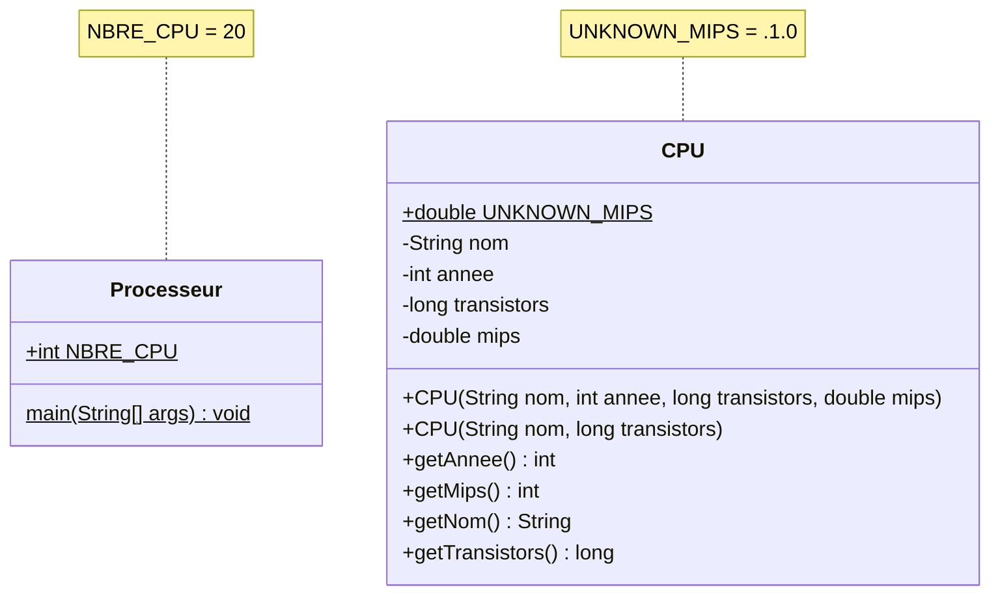

# Exercice 03 : Les Processeurs A - Solution
## Durée : 120'
## Objectifs visés :
Utilisation de classes, fabrication et utilisation d‘objets, communication entre objets.

Affinage progressif de la solution :
- Partie 1 – version initiale
- Partie 2 – surcharge de toString() puis sout() direct de l’objet, découverte des littéraux
- Partie 3 – Formatage de nombres entiers et de nombres à virgule flottante

## PARTIE 1 : Créer la version initiale
Réalisez l’application décrite ci-après. Vous trouverez toute l’information utile directement dans ce document, sous forme de :
- diagrammes des classes => les classes à créer, leurs méthodes et attributs
- Javadoc => description précise chacune des classes, de leurs méthodes et attributs
- Portions de code => code qui vous est directement donné

### Diagramme de classes


### Javadoc
La Javadoc se trouve directement dans les classes Java. Il ne vous reste plus qu'à remplacer les commentaires `// VOTRE CODE ICI...`

### Portions de code
La méthode `main()` de l'application vous est donnée.

## PARTIE 2 : Surchage de la méthode toString() et découverte des littéraux
Faites-en sorte qu’un objet `CPU` sache se représenter lui-même sous forme de chaîne de caractères. Pour cela, surchargez sa méthode `toString()` et implémentez-là comme précédemment (= de façon à ce qu’elle produise la même représentation textuelle qu’avant).

Depuis le `main()`, dans la boucle d’affichage des éléments de la liste, faites directement un sout de l’objet (qui saura désormais se représenter sous forme de String).

### Question(s)

Pourquoi y a-t-il un **L** majuscule à la fin des deux dernières valeurs utilisées pour exprimer le nombre de transistors ?

```
    cpus[ 14 ] = new CPU( "Intel Core i7 (Haswell-E)", 2014, 2600000000L, 238310 );
    cpus[ 15 ] = new CPU( "Oracle SPARC M7", 2015, 10000000000L );
```

Consigner votre réponse dans le fichier [REPONSES.md](REPONSES.md) et également dans votre documentation de projet.

## PARTIE 3 : Formatage de nombres entiers et de nombres à virgule flottante
Lorsqu’on affiche des objets CPU à l’écran cela donne des lignes qui ressemblent à ceci :
```
En 1971 le CPU Intel 4004 avec 2300 transistors et une puissance de calcul de 0.06 mips.
En 1972 le CPU Intel 8088 avec 3500 transistors et une puissance de calcul de 0.06 mips.
En 1978 le CPU Intel 8086 avec 29000 transistors et une puissance de calcul de 0.33 mips.
En 1982 le CPU Intel 80286 avec 134000 transistors et une puissance de calcul de 1.0 mips.
.
.
.
En 2010 le CPU Intel Core i7 (Gulftown) avec 1170000000 transistors et une puissance de calcul de 147600.0 mips.
En 2014 le CPU Intel Core i7 (Haswell-E) avec 2600000000 transistors et une puissance de calcul de 238310.0 mips.
En 2015 le CPU Oracle SPARC M7 avec 10000000000 transistors et une puissance de calcul inconnue.
```
Ce que nous aimerions, c’est un affichage plus lisible des nombres entiers et des nombres à virgule flottante, de cette manière :
```
En 1971 le CPU Intel 4004 avec 2'300 transistors et une puissance de calcul de 0.06 mips.
En 1972 le CPU Intel 8088 avec 3'500 transistors et une puissance de calcul de 0.06 mips.
En 1978 le CPU Intel 8086 avec 29'000 transistors et une puissance de calcul de 0.33 mips.
En 1982 le CPU Intel 80286 avec 134'000 transistors et une puissance de calcul de 1.00 mips.
.
.
.
En 2010 le CPU Intel Core i7 (Gulftown) avec 1'170'000'000 transistors et une puissance de calcul de 147'600.00 mips.
En 2014 le CPU Intel Core i7 (Haswell-E) avec 2'600'000'000 transistors et une puissance de calcul de 238'310.00 mips.
En 2015 le CPU Oracle SPARC M7 avec 10'000'000'000 transistors et une puissance de calcul inconnue.
```
Modifiez la surcharge de la méthode `toString()` de la classe `CPU`. Utilisez les formateurs adéquats pour formater les nombres entiers et les nombres à virgule flottante sous la forme désirée.

Testez ensuite votre programme avec soin, pas par pas avec le débogueur.